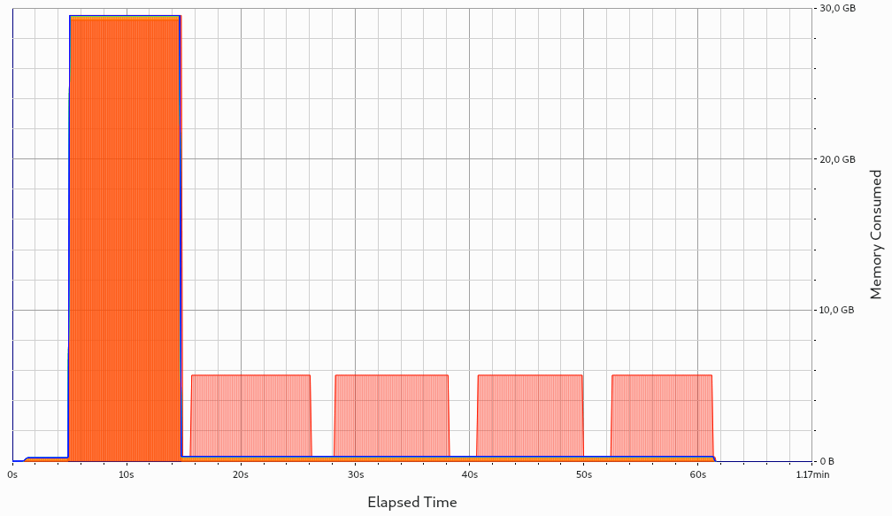
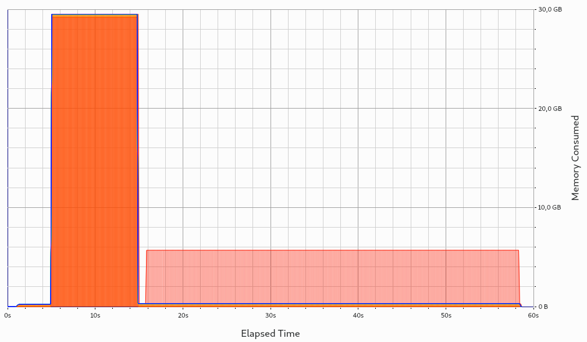
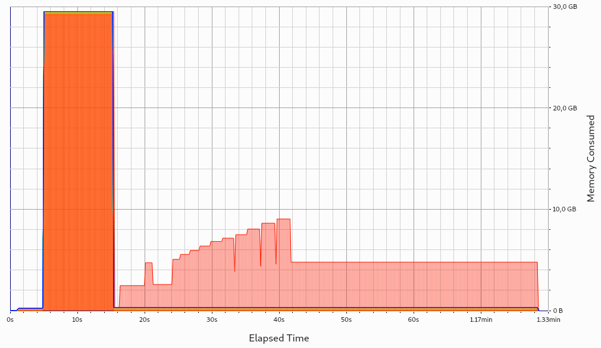
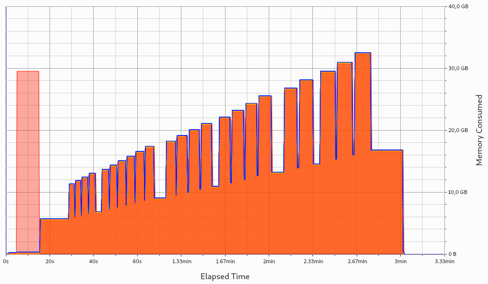

.. _backends-adios2:

ADIOS2
======

openPMD supports writing to and reading from ADIOS2 ``.bp`` files.
For this, the installed copy of openPMD must have been built with support for the ADIOS2 backend.
To build openPMD with support for ADIOS2, use the CMake option ``-DopenPMD_USE_ADIOS2=ON``.
For further information, check out the :ref:`installation guide <install>`,
:ref:`build dependencies <development-dependencies>` and the :ref:`build options <development-buildoptions>`.

I/O Method
----------

ADIOS2 has several engines for alternative file formats and other kinds of backends, yet natively writes to ``.bp`` files.
The openPMD API uses the BP4 engine as the default file engine and the SST engine for streaming support.
We currently leverage the default ADIOS2 transport parameters, i.e. ``POSIX`` on Unix systems and ``FStream`` on Windows.

Steps
-----

ADIOS2 is optimized towards organizing the process of reading/writing data into IO steps.
In order to activate steps, it is imperative to use the :ref:`Streaming API <usage-streaming>` (which can be used for either file-based or streaming-based workflows).

ADIOS2 release 2.6.0 contained a bug (fixed in ADIOS 2.7.0, see `PR #2348 <https://github.com/ornladios/ADIOS2/pull/2348>`_) that disallows random-accessing steps in file-based engines.
With this ADIOS2 release, files written with steps may only be read using the streaming API.
In order to keep compatibility with older codes reading ADIOS2 files, step-based processing must currently be opted in to via use of the :ref:`JSON parameter<backendconfig>` ``adios2.engine.usesteps = true`` when using a file-based engine such as BP3 or BP4.

Upon reading a file, the ADIOS2 backend will automatically recognize whether it has been written with or without steps, ignoring the JSON option mentioned above.
Steps are mandatory for streaming-based engines and trying to switch them off will result in a runtime error.

.. note::

   ADIOS2 will in general dump data to disk/transport only upon closing a file/engine or a step.
   If not using steps, users are hence strongly encouraged to use file-based iteration layout (by creating a Series with a filename pattern such as ``simData_%06T.bp``) and enforce dumping to disk by ``Iteration::close()``-ing an iteration after writing to it.
   Otherwise, out-of-memory errors are likely to occur.

Backend-Specific Controls
-------------------------

The ADIOS2 SST engine for streaming can be picked by specifying the ending ``.sst`` instead of ``.bp``.

The following environment variables control ADIOS2 I/O behavior at runtime.
Fine-tuning these is especially useful when running at large scale.

===================================== ========== ================================================================================
environment variable                  default    description
===================================== ========== ================================================================================
``OPENPMD_ADIOS2_HAVE_PROFILING``     ``1``      Turns on/off profiling information right after a run.
``OPENPMD_ADIOS2_HAVE_METADATA_FILE`` ``1``      Online creation of the adios journal file (``1``: yes, ``0``: no).
``OPENPMD_ADIOS2_NUM_SUBSTREAMS``     ``0``      Number of files to be created, 0 indicates maximum number possible.
``OPENPMD_ADIOS2_ENGINE``             ``File``   `ADIOS2 engine <https://adios2.readthedocs.io/en/latest/engines/engines.html>`_
``OPENPMD2_ADIOS2_SCHEMA``            ``0``      ADIOS2 schema version (see below)
``OPENPMD_ADIOS2_STATS_LEVEL``        ``0``      whether to generate statistics for variables in ADIOS2. (``1``: yes, ``0``: no).
``OPENPMD_BP_BACKEND``                ``ADIOS2`` Chose preferred ``.bp`` file backend if ``ADIOS1`` and ``ADIOS2`` are available.
===================================== ========== ================================================================================

Please refer to the `ADIOS2 documentation <https://adios2.readthedocs.io/en/latest/engines/engines.html>`_ for details on I/O tuning.

In case the ADIOS2 backend was not compiled but only the deprecated :ref:`ADIOS1 backend <backends-adios1>`, the default of ``OPENPMD_BP_BACKEND`` will fall back to ``ADIOS1``.
Be advised that ADIOS1 only supports ``.bp`` files up to the internal version BP3, while ADIOS2 supports BP3, BP4 and later formats.

Notice that the ADIOS2 backend is alternatively configurable via :ref:`JSON parameters <backendconfig>`.

Due to performance considerations, the ADIOS2 backend configures ADIOS2 not to compute any dataset statistics (Min/Max) by default.
Statistics may be activated by setting the :ref:`JSON parameter <backendconfig>` ``adios2.engine.parameters.StatsLevel = "1"``.

The ADIOS2 backend overrides the default unlimited queueing behavior of the SST engine with a more cautious limit of 2 steps that may be held in the queue at one time.
The default behavior may be restored by setting the :ref:`JSON parameter <backendconfig>` ``adios2.engine.parameters.QueueLimit = "0"``.

Best Practice at Large Scale
----------------------------

A good practice at scale is to disable the online creation of the metadata file.
After writing the data, run ``bpmeta`` on the (to-be-created) filename to generate the metadata file offline (repeat per iteration for file-based encoding).
This metadata file is needed for reading, while the actual heavy data resides in ``<metadata filename>.dir/`` directories.
Note that such a tool is not yet available for ADIOS2, but the ``bpmeta`` utility provided by ADIOS1 is capable of processing files written by ADIOS2.

Further options depend heavily on filesystem type, specific file striping, network infrastructure and available RAM on the aggregator nodes.
A good number for substreams is usually the number of contributing nodes divided by four.

For fine-tuning at extreme scale or for exotic systems, please refer to the ADIOS2 manual and talk to your filesystem admins and the ADIOS2 authors.
Be aware that extreme-scale I/O is a research topic after all.

Experimental new ADIOS2 schema
------------------------------

We are experimenting with a breaking change to our layout of openPMD datasets in ADIOS2.
It is likely that we will in future use ADIOS attributes only for a handful of internal flags.
Actual openPMD attributes will be modeled by ADIOS variables of the same name.
In order to distinguish datasets from attributes, datasets will be suffixed by ``/__data__``.

We hope that this will bring several advantages:

* Unlike ADIOS attributes, ADIOS variables are mutable.
* ADIOS variables are more closely related to the concept of ADIOS steps.
  An ADIOS variable that is not written to in one step is not seen by the reader.
  This will bring more manageable amounts of metadata for readers to parse through.

The new layout may be activated **for experimental purposes** in two ways:

* Via the JSON parameter ``adios2.schema = 20210209``.
* Via the environment variable ``export OPENPMD2_ADIOS2_SCHEMA=20210209``.

The ADIOS2 backend will automatically recognize the layout that has been used by a writer when reading a dataset.

Memory usage
------------

The IO strategy in ADIOS2 is to stage all written data in a large per-process buffer.
This buffer is drained to storage only at specific times:

1. When an engine is closed.
2. When a step is closed.

The usage pattern of openPMD, especially the choice of iteration encoding influences the memory use of ADIOS2.
The following graphs are created from a real-world application using openPMD (PIConGPU) using KDE Heaptrack.
Ignore the 30GB initialization phases.

* **file-based iteration encoding:** A new ADIOS2 engine is opened for each iteration and closed upon ``Iteration::close()``.
  Each iteration has its own buffer:

* **variable-based iteration encoding and group-based iteration encoding with steps**:
  One buffer is created and reused across all iterations.
  It is drained to disk when closing a step.
  If carefully selecting the correct ``InitialBufferSize``, this is merely one single allocation held across all iterations.
  If selecting the ``InitialBufferSize`` too small, reallocations will occur.
  As usual with ``std::vector`` (which ADIOS2 uses internally), a reallocation will occupy both the old and new memory for a short time, leading to small memory spikes.
  These memory spikes can easily lead to OOM situations, motivating that the ``InitialBufferSize`` should not be chosen too small.
  Both behaviors are depicted in the following two pictures:

* **group-based iteration encoding without steps:**
  This encoding **should be avoided** in ADIOS2.
  No data will be written to disk before closing the ``Series``, leading to a continuous buildup of memory, and most likely to an OOM situation:

Selected References
-------------------

* Hasan Abbasi, Matthew Wolf, Greg Eisenhauer, Scott Klasky, Karsten Schwan, and Fang Zheng.
  *Datastager: scalable data staging services for petascale applications,*
  Cluster Computing, 13(3):277–290, 2010.
  `DOI:10.1007/s10586-010-0135-6 <https://doi.org/10.1007/s10586-010-0135-6>`_

* Ciprian Docan, Manish Parashar, and Scott Klasky.
  *DataSpaces: An interaction and coordination framework or coupled simulation workflows,*
  In Proc. of 19th International Symposium on High Performance and Distributed Computing (HPDC’10), June 2010.
  `DOI:10.1007/s10586-011-0162-y <https://doi.org/10.1007/s10586-011-0162-y>`_

* Qing Liu, Jeremy Logan, Yuan Tian, Hasan Abbasi, Norbert Podhorszki, Jong Youl Choi, Scott Klasky, Roselyne Tchoua, Jay Lofstead, Ron Oldfield, Manish Parashar, Nagiza Samatova, Karsten Schwan, Arie Shoshani, Matthew Wolf, Kesheng Wu, and Weikuan Yu.
  *Hello ADIOS: the challenges and lessons of developing leadership class I/O frameworks,*
  Concurrency and Computation: Practice and Experience, 26(7):1453–1473, 2014.
  `DOI:10.1002/cpe.3125 <https://doi.org/10.1002/cpe.3125>`_

* Robert McLay, Doug James, Si Liu, John Cazes, and William Barth.
  *A user-friendly approach for tuning parallel file operations,*
  In Proceedings of the International Conference for High Performance Computing, Networking, Storage and Analysis, SC'14, pages 229–236, IEEE Press, 2014.
  `DOI:10.1109/SC.2014.24 <https://doi.org/10.1109/SC.2014.24>`_

* Axel Huebl, Rene Widera, Felix Schmitt, Alexander Matthes, Norbert Podhorszki, Jong Youl Choi, Scott Klasky, and Michael Bussmann.
  *On the Scalability of Data Reduction Techniques in Current and Upcoming HPC Systems from an Application Perspective,*
  ISC High Performance 2017: High Performance Computing, pp. 15-29, 2017.
  `arXiv:1706.00522 <https://arxiv.org/abs/1706.00522>`_, `DOI:10.1007/978-3-319-67630-2_2 <https://doi.org/10.1007/978-3-319-67630-2_2>`_
