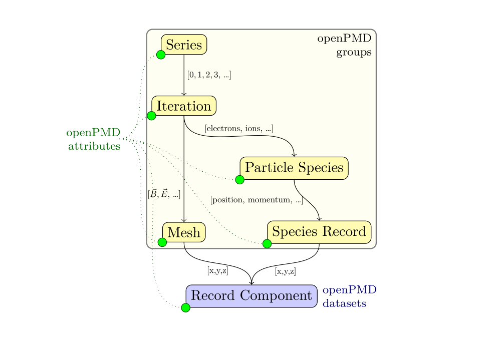

.. _concepts:

Concepts
========

For a first high-level overview on openPMD, please see `www.openPMD.org <https://www.openPMD.org>`__.

openPMD defines data series of particles and mesh based data in the `openPMD-standard <https://github.com/openPMD/openPMD-standard>`__.
See for example the `openPMD base standard definition, version 1.1.0 <https://github.com/openPMD/openPMD-standard/blob/1.1.0/STANDARD.md>`__.

Records and Record Components
-----------------------------

At the bottom of openPMD is an *Record* that stores data in *record components*.
A record is an data set with common properties, e.g. the electric field :math:`\vec E` with three components :math:`E_x, E_y, E_z` can be a record.
A density field could be another record - which is scalar as it only has one component.

In general, openPMD allows records with arbitrary number of components (tensors), as well as vector records and scalar records.
In the case of vector records, the single components are stored as datasets within the record.
In the case of scalar records, the record and component are equivalent.
In the API, the record can be directly used as a component, and in the standard a scalar record is represented by the scalar dataset with attributes.

Meshes and Particles
--------------------

Records can be either (structured) meshes, e.g. a gridded electric field as mentioned above, or particle records.

*Mesh* records are logically n-dimensional arrays.
The openPMD standard (see above) supports a various mesh geometries, while more can be standardized in the future.
Ongoing work also adds support for `block-structured mesh-refinement <https://github.com/openPMD/openPMD-standard/pull/252>`__.

*Particle species* on the other hand group a number of particle records that are themselves stored as (logical) 1d arrays in record components.
Conceptually, one could also think as particles *table* or *dataframe*, where each row represents a particle.

Iteration and Series
--------------------

Updates to records are stored in an *Iteration*.
Iterations are numbered by integers, do not need to be consecutive and can for example be used to store a the evolution of records over time.

The collection of iterations is called a *Series*.
openPMD-api implements various file-formats (backends) and encoding strategies for openPMD Series, from simple one-file-per-iteration writes over using the backend-provided support for internal updates of records to data streaming techniques.

**Iteration encoding:** The openPMD-api can encode iterations in different ways.
The method ``Series::setIterationEncoding()`` (C++) or ``Series.set_iteration_encoding()`` (Python) may be used in writing for selecting one of the following encodings explicitly:

* **group-based iteration encoding:** This encoding is the default.
  It creates a separate group in the hierarchy of the openPMD standard for each iteration.
  As an example, all data pertaining to iteration 0 may be found in group ``/data/0``, for iteration 100 in ``/data/100``.
* **file-based iteration encoding:** A unique file on the filesystem is created for each iteration.
  The preferred way to create a file-based iteration encoding is by specifying an expansion pattern in the ``filepath`` argument of the constructor of the ``Series`` class.
  Creating a ``Series`` by the filepath ``"series_%T.json"`` will create files ``series_0.json``, ``series_100.json`` and ``series_200.json`` for iterations 0, 100 and 200.
  A padding may be specified by ``"series_%06T.json"`` to create files ``series_000000.json``, ``series_000100.json`` and ``series_000200.json``.
  The inner group layout of each file is identical to that of the group-based encoding.
* **variable-based iteration encoding:** This experimental encoding uses a feature of some backends (i.e., ADIOS2) to maintain datasets and attributes in several versions (i.e., iterations are stored inside *variables*).
  No iteration-specific groups are created and the corresponding layer is dropped from the openPMD hierarchy.
  In backends that do not support this feature, a series created with this encoding can only contain one iteration.

Spellings for constants in the C++ (``IterationEncoding``) and Python (``Iteration_Encoding``) API: ``groupBased``, ``variableBased``, ``fileBased``, ``group_based``, ``group_based``, ``variable_based``

Attributes
----------

openPMD defines a minimal set of standardized meta-data *Attributes* to for scientific self-description and portability.
Such attributes are showcased in the following section and include for example the physical quantities in a record, unit conversions, time and gridding information.

Besides the standardized attributes, arbitrary additional attributes can be added to openPMD data and openPMD-api supports adding use-defined attributes on every object of the herein described hierarchy.

.. tip::

   Does all of this sound a bit too theoretical?
   Just jump to the next section and see an example in action.
